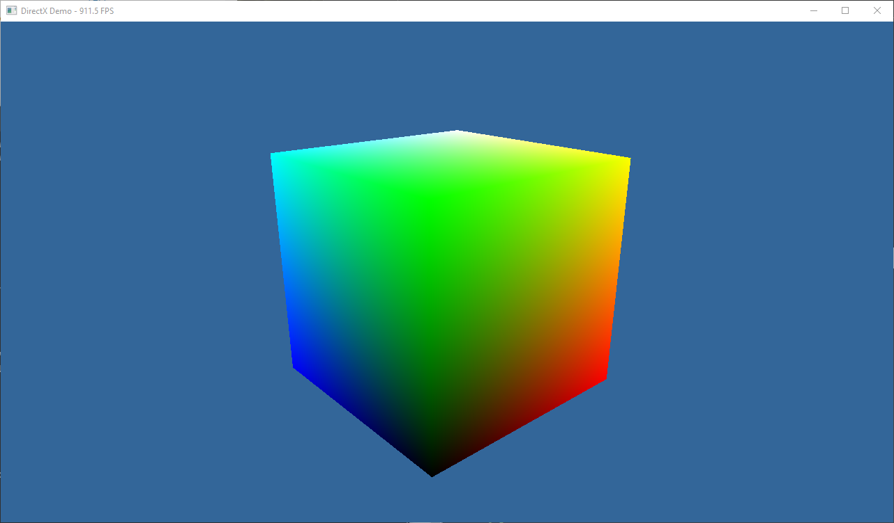
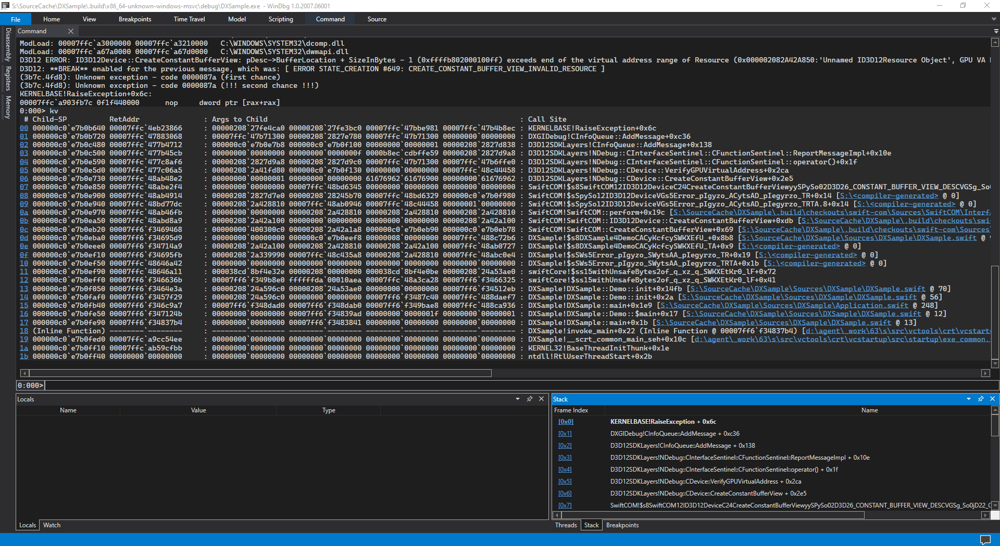

DXSample
--------

<p align="center">
  
</p>

This sample application shows how to use [Swift](https://www.swift.org),
[Swift/COM](https://github.com/compnerd/swift-com) to build an application which
leverages DirectX 12 on Windows 10.

This sample is a proof of concept of the possible functionality but does not
follow many best graphics best practices.  This code eschews V-Sync support for
simplicity in the code, doing simple double buffering.  There are many math
routines which are transliterated from the DXMath library by Microsoft.  It also
does not try to optimize the math routines, opting instead for simplicity in the
code.  Many pieces of trivial functionality, e.g. fullscreen support, are simply
discarded for brevity.
 
## Build Requirements

- Latest Swift **Development** Snapshot (2021-02-18 or later)<sup>[1](#snapshot-requirement)</sup>
- Windows SDK 10.0.107763 or newer
- Windows 10

<sup><a name="snapshot-requirements">1</a></sup> Stable releases are not
currently supported as they are built from release branches and this project
requires the latest development snapshot from the `main` branch.<br/>

## Building

This project requires the latest Swift snapshot (February 18, 2021 or newer).
You can use the snapshot binaries from
[swift.org](https://swift.org/download#snapshots) or download the nightly build
from [Azure](https://dev.azure.com/compnerd/swift-build/_build?definitionId=7).

### Building the Demo

Simply running the demo, as described below, will implicitly build the demo
program.  However, should you wish to explicitly build the demo application you
can do so as:

```cmd
swift build
```

### Running the Demo

With SPM, you can simply run the target demo program.  Because there is only a
single executable in the repository, you can simply run it using the following:

```cmd
swift run
```

### Debugging

Debugging this demo is complicated as there are separate portions involved:
  1. Swift application code
  2. System integration for DirectX

LLDB currently does not support debugging with PDBs very well and does not
have the same level of conveniences that WinDBG may support.  Depending on which
portion is being debugged you may have better experiences with different
debugging approaches.

For debugging the Swift application code, it is easier to debug using LLDB and
DWARF.  In such a case, you will need to build the application as follows to
enable the debug information:

```cmd
swift build -Xlinker -debug:dwarf
```

For debugging the DirectX support, the WinDBG support may be more convenient.
In such a case, it would be better to build the application with CodeView and
PDBs to allow WinDBG to provide stack traces in addition to the additional
information from the debug mode.  You can build that using the following
command:

```cmd
swift build -Xswiftc -g -Xswiftc -debug-info-format=codeview -Xlinker -debug
```

When the demo application is built in the `Debug` configuration, additional
debugging features are enabled in DirectX.  This will include halting execution
on any warning from the execution of the DirectX pipeline.

<p align="center">
  
</p>
